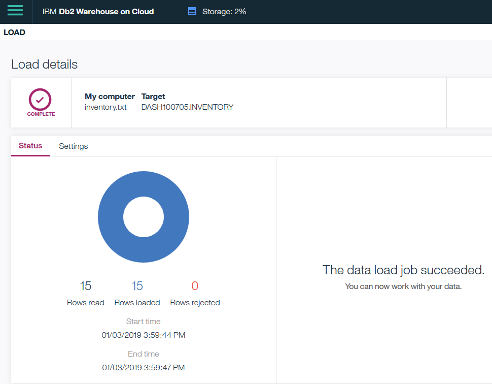

[](https://travis-ci.org/IBM/virtualhelpdesk)

# Building a dashboard within IBM Cloud

In this code pattern, you learn how to build dashboard with IBM Cloud services. There are many ways to develop a dashboard. This code pattern adds one more option to your collection.

For optimal performance, all required data for the dashboard resides in a single DB2 database, an instance of DB2 Warehouse (formally dashDB) in IBM Cloud. At the time of this writing, the dashboard component of Watson Studio is limited to the following data sources.
* CSV files
* Connection to Db2 Warehouse on Cloud
* Connection to Compose for PostgreSQL
* Connection to Microsoft SQL Server on Cloud
* Data from a Db2 Warehouse on Cloud, Compose for PostgreSQL, or a Microsoft SQL Server on Cloud connection

If you have multiple data sources, you may pre-process all your data and stage them in DB2 Warehouse instance through batch processes.

When you complete this code pattern, you will understand how to:
* Build dashboard with Watson Studio
* Configure DB2 Warehouse and populate sample data
* Optionally, IBM Cloud Function which can help populate DB2 Warehouse from other data source


## Flow
1. Administrator configures DB2 Warehouse instance and populate data.
1. Optionally, developer devlopes code to pre-process data in multiple data sources and stage processed data in DB2 Warehouse.
1. Developer builds dashboard through Watson Studio.
1. Administrator grants access to the dashboard.
1. End users view the dashboard.


## Included Components
* [Watson Studio](https://dataplatform.cloud.ibm.com/docs/content/analyze-data/analytics-dashboard.html): With the analytics dashboard, you can build sophisticated visualizations of your analytics results, communicate the insights that you've discovered in your data on the dashboard and then share the dashboard with others.
* [DB2 Warehouse](https://www.ibm.com/cloud/db2-warehouse-on-cloud): IBM Db2® Warehouse on Cloud is an elastic, fully managed cloud data warehouse service that's powered by IBM BLU Acceleration® technology for increased performance and optimization of analytics at a massive scale.

## Featured technologies
* [Cognitive](https://developer.ibm.com/watson/): Watson is a cognitive technology that can think like a human.


## Watch the Video

[](https://www.youtube.com/watch?v=4IsYkTCHgzE)


## DB2 Warehouse Configuration

In this code pattern, all data required for the dashboard is stored in DB2 Warehouse instance. Before creating your dashboard, you'll create an instance of DB2 Warehouse, configure the instance, create tables and populate the tables.


### Creating an instance of DB2 Warehouse

To create a new instance of DB2 Warehouse,

1. Login to [IBM Cloud console](https://console.ng.bluemix.net). 
2. Navigate to [**DB2 Warehouse**](https://console.bluemix.net/catalog/services/db2-warehouse) page.
3. Enter an unique Service name, for example `Db2-Warehouse-lz`.
4. Select proper region/location, organization and space, or take the default.
5. Select a pricing plan. 

Note, at the time of this writing, the `Entry` plan (the most basic plan of DB2 Warehouse) costs $50 per month. However, you'll find a `Free trial` statement: `You can try the Db2 Warehouse on Cloud Entry plan with up to 1 GB of storage without charge` on `Getting started` tab, after the DB2 Warehouse instance is created. 

6. Select the `Create` button.


### Connection Credential

1. Login to [IBM Cloud console](https://console.ng.bluemix.net). 
2. Locate and open the newly created DB2 Warehouse instance.
3. Select `Service credentials` tab in the left pane.
4. `New credential`.
5. `Add`.
6. `View credentials`.
7. Take note of `hostname`, `username`, `password` and `db`.


### Creating DB2 Tables

To create tables,

1. Login to [IBM Cloud console](https://console.ng.bluemix.net). 
2. Locate and open the newly created DB2 Warehouse instance.
3. Select `Manage` tab in the left pane.
4. Select `Open Console` button.


5. `IBM DB2 Warehouse on Cloud` window is displayed.
6. From the top-right dropdown menu, select `RUN SQL` option.


7. Copy and paste the SQL statement below into IBM Cloud console.

```
--Create
CREATE TABLE sales
( sales_id INT NOT NULL generated always as identity (start with 1000, increment by 1), CONSTRAINT sales_pk PRIMARY KEY (sales_id),
amount DECIMAL(15,2) NOT NULL,
period VARCHAR(50) NOT NULL,
region VARCHAR(50) NOT NULL,
sales_person VARCHAR(50) NOT NULL
);

CREATE TABLE inventory
( inventory_id INT NOT NULL generated always as identity (start with 1000, increment by 1), CONSTRAINT inventory_pk PRIMARY KEY (inventory_id),
product VARCHAR(50) NOT NULL,
quatity DECIMAL(15,2) NOT NULL,
location VARCHAR(50) NOT NULL,
region VARCHAR(50) NOT NULL
)
--End of Create
```

8. Select `Run -> Run All` action to create the `sales` and `inventory` table.


### Reviewing DB2 Table Schema

To review the table schema,

1. In the `IBM DB2 Warehouse on Cloud` window, from the top-right dropdown menu, select `EXPLORE` option.
2. In the `Schema` pane on the left, highlight `DASHxxxxx` sechma.
3. In the `Table` pane on the right, highlight table `SALES`.
4. `Table definition` pane is opened on the right.
5. Repeat step 3 and 4 to review table `INVENTORY`.


### Populating DB2 Tables

To load sample data,

1. In the `IBM DB2 Warehouse on Cloud` window, from the top-right dropdown menu, select `LOAD` option.
2. In the `File selection` section, select the `browse files` link.
3. Locate and select the file sample/inventory.txt.
4. `Next`.
5. Select `DASHxxxxx` schema.
6. Select `INVENTORY` table.
7. `Next`.
8. Uncheck the `Header in first row` option.


9. `Next`.
10. `Begin Load`.
11. Contents in file sample/inventory.txt was loaded into the table `INVENTORY`.



12. Repeat the step 2 to 11 to load the contents in file sample/sales.txt into the table `SALES`.


### Viewing contents in DB2 Tables

To view contents in DB2 tables,

1. In the `IBM DB2 Warehouse on Cloud` window, from the top-right dropdown menu, select `EXPLORE` option.
2. In the `Schema` pane on the left, highlight `DASHxxxxx` sechma.
3. In the `Table` pane on the right, highlight table `SALES`.
4. In the `Table definition` pane on the right, select `View Data`.
5. 15 rows of data is displayed.
6. Repeat step 3 and 5 to review table `INVENTORY`.


## IBM Cloud Function and Data Pre-processing Discussion

For simplicity, all data required for the dashboard resides in the DB2 Warehouse in IBM Cloud. In real world, you likely have multiple data sources at different location. 

At the time of the writing, the dashboard component of Watson Studio is limited to few data sources and DB2 Warehouse is one of them. One way to address this limitation is to pre-process your data and stage data required for the dashboard in the DB2 Warehouse instance.

IBM Cloud Functions can be a good candidate for data pre-processing. It can help you process data in batch mode on schedule. It supports many run-time environment based on your skill set.

IBM Cloud Functions (based on Apache OpenWhisk) is a Function-as-a-Service (FaaS) platform which executes functions in response to incoming events and costs nothing when not in use

As different dashboard project may have different data sources, a sample use case is used in this section to illustrate how the data pre-prpcessing can be done via IBM Cloud Function. It may take inputs from multiple sources and populate your DB2 Warehouse instance. Populating DB2 Warehouse instance is the focus of this section.

### Creating Action, Trigger and Rule

To populate DB2 Warehouse instance via IBM Cloud Function,

1. Install [IBM Cloud CLI](https://console.bluemix.net/docs/cli/reference/ibmcloud/download_cli.html#install_use) if necessary.
1. Install [IBM Install the Cloud Functions Plugin](https://console.bluemix.net/openwhisk/learn/cli) if necesaary.
1. Open a command window.
1. Execute command `ibmcloud login`.
1. Execute command `ibmcloud target --cf` to set org and space.
1. Execute command `ibmcloud fn package create mydashboard` to create a package bundling related actions in IBM Cloud Function.
1. Execute command `ibmcloud fn action create mydashboard/dataInsert dataInsert.js --kind nodejs:8` to create an action.
1. Execute command `ibmcloud fn service bind dashDB mydashboard/dataInsert --instance Db2-Warehouse-lz` to bind the new action to credentials of your DB2 Warehouse instance `Db2-Warehouse-lz`.
1. Execute command `ibmcloud fn action invoke mydashboard/dataInsert -r -v` to invoke the new action once. The action inserts two rows of new data into table `SALES`. You may verify this through `DB2 Warehouse` user interface.
1. Execute the command below to create a time-based schedule trigger. In this example, it fires up in every one minutes, starts on 01/16/2019 morning and ends on 01/16/2019 midnight. 

    ```
    ibmcloud fn trigger create every-60-seconds \
        --feed /whisk.system/alarms/alarm \
        --param cron "*/60 * * * * *"   
    ```
1. Execute the following command to create rule `invoke-periodically`,

    ```
    ibmcloud fn rule create \
        invoke-periodically \
        every-60-seconds \
        mydashboard/dataInsert
    ```
Rules provide a mechanism for mapping triggers to actions in a many-to-many relationship. That is, one trigger can fire many independent actions and a single action can be triggered by many different triggers.

This rule shows how the `every-60-seconds` trigger can be declaratively mapped to the `mydashboard/dataInsert` action. Notice that it's named somewhat abstractly so that if we wanted to use a different trigger - perhaps something that fires every five minute instead - we could still keep the same logical name.


### Verifying Action, Trigger and Rule

To verify that the IBM Cloud Function Action is fired every 60 seconds,

1. Open a command/terminal window.
1. Execute command `ibmcloud fn activation poll`. This command allows you to stream the console.log() statements in the action.
1. Wait for a few minutes and observe log entries from the action.

To verify additional data has been inserted into table 'SALES`,

1. In the `IBM DB2 Warehouse on Cloud` window, from the top-right dropdown menu, select `EXPLORE` option.
2. In the `Schema` pane on the left, highlight `DASHxxxxx` sechma.
3. In the `Table` pane on the right, highlight table `SALES`.
4. In the `Table definition` pane on the right, select `View Data`.
5. 17+ rows of data is displayed.
6. Refresh the user interface after a minute, the count of row the table is increased.


### IBM Cloud Function Clean Up

If you want to clean up action, trigger and rule,

1. To remove rule `invoke-periodically`, execute commands

    ```
    ibmcloud fn rule disable invoke-periodically
    ibmcloud fn rule delete invoke-periodically
    ```
1. to remove trigger `every-60-seconds`, execute command

    ```
    ibmcloud fn trigger delete every-60-seconds
    ```

1. To remove action `mydashboard/dataInsert`, execute command

    ```
    ibmcloud fn action delete mydashboard/dataInsert
    ```


## Creating an instance of IBM Cognos Dashboard Embedded

To create an instance of IBM Cognos Dashboard Embedded,

1. Login to [IBM Cloud console](https://console.ng.bluemix.net). 
2. Navigate to [**IBM Cognos Dashboard Embedded**](https://console.bluemix.net/catalog/services/ibm-cognos-dashboard-embedded) page.
3. Enter an unique Service name, for example `IBM-Cognos-Dashboard-Embedded-lz`.
4. Select proper region/location and resource group, or take the default.
5. Select a pricing plan. 
6. `Create`.


## Building Dashboard

Now you are ready to build dashboard.


### Creating a Watson Studio Instance

To create an instance of Watson Studio,

1. Login to [IBM Cloud console](https://console.ng.bluemix.net). 
2. Navigate to [**Watson Studio**](https://console.bluemix.net/catalog/services/watson-studio) page.
3. Enter an unique Service name, for example `Watson-Studio-lz`.
4. Select proper region/location and resource group, or take the default.
5. Select a pricing plan. 
6. `Create`.
7. Select `Get Started` to navigate to the `IBM Watson Studio` window after the new Watson Studio instance is created.


### Creating a Watson Studio project

To create a project in Watson Studio,

1. In the `IBM Watson Studio` window, select `Create a project`.
1. In the `Create a project` window, click `Create Project` in the `Business Analytics` tile. 
1. Select a `Region`, for example `US South`.
1. Enter an unique `Project Name` and optional `Description`. 
1. Select `Storage` and `Cognos Dashboard Embedded` instance. You may be prompted for creating `Storage` and `Cognos Dashboard Embedded` instance if you don't have one defined.
1. `Create`.
1. Review the new project.


### Adding Data Assets to the Project

To add data assets to the project,

1. In the `IBM Watson Studio` window, select `Projects` from the menu on the top and then select the newly created project.


2. From the project menu, navigate to `Assets` tab.


3. `Add to project`.
4. In `Choose asset type` window, select `CONNECTION`.
5. Select `IBM DB2 Warehouse`.
6. The `New connection` window is opened. It has three sections, `Your service instances in IBM Cloud`, `IBM services` and `Third-party services`.
7. Under the section `Your service instances in IBM Cloud`, locate and select your `DB2 Warehouse` instance.
8. `Name`, `Description`, `Username`, `Password`, `Hostname or IP Address` and `Database` are populated for your connection.
9. `Create`.
10. New `Data asset` is created.


### Adding Dashboard to the Project

To add Dashboard component to the project,

1. In the `IBM Watson Studio` window, select `Projects` from the menu on the top and then select the newly created project.
2. From the project menu, navigate to `Assets` tab.
3. `Add to project`.
4. In `Choose asset type` window, select `DASHBOARD`.
5. Enter `Name` and optional `Description`.
6. Select `Cognos Dashboard Embedded Service`.
7. `Save`.
8. Select `Tabbed layout` and `Freeform` in the `Select a template` window.
9. `OK`.
10. Double clieck `Tab 1` of the dashboard to highlight the tab title and change it to `Sales`.
11. Select `+` next to `Sales` tab. 
12. Select `Freeform` as template.
13. `Use`.
14. Double clieck `Tab 1` of the dashboard to highlight the tab title and change it to `Inventory`.


### Selecting Data Sources for the Dashboard

Before developing the Dashboard, data sources are going to be selected.

1. In the `Selected sources` pane on the left, select the `+` icon on the top.
2. `Select connection source` window is displayed.
3. Navigate to `Connections` tab.
4. Select the connection `DB2-Warehouse-lz` under `Connections`.
5. Select the schema `DASHxxxxx` under `Schemas`.
6. Select the table `SALES` under `Tables`.
7. Click the `Select` button.
8. Repeat step 1 - 7 to add `INVENTORY` table as data source.


### Developing Sales tab of Dashboard

To develop the Sales tab of Dashboard,

1. In the `Selected sources` pane on the left, select `SALES` table.
2. Extend the `SALES` table. All columns of the table `SALES` is displayed under the table name.


3. Drag the column `AMOUMT` and drop onto the the dashboard on the right. 
4. Highlight the content of `AMOUMT` on the the dashboard and select `Change visualization` icon. It's the thrid icon from the top.


5. Change the visualization to `Table`. The default is `Automatic`.
6. Move the table to the top-left corner and resize it.
7. Add column `PERIOD`, `REGION` and `SALES-PERSON` to the table one by one.
8. Select the `Widgets` tab on the left.


9. Select `Text` widget icon in the left pane.
10. Move the `Text` widget above the existing table and change its content to `Raw Sales Data.


11. Select the `Sources` tab on the left.
11. Drag the column `AMOUMT` and drop to a blank space on the the dashboard. Move it to the bottom of the dashboard.
12. Highlight the new `AMOUMT` on the the dashboard and select `Change visualization` icon. It's the thrid icon from the top.
13. Change the visualization to `Table`.
14. Reposition and resize the table.
15. Add column `PERIOD` to the table. Note the dashboard automatically summarizes the data by period.
16. Sort the table by column `PERIOD`.
17. Add a text label for the second table as `Sales by Period`.


18. Select the `Sources` tab on the left. 
19. Drag the column `AMOUMT` and drop to a blank space on the the dashboard. Move it to the bottom of the dashboard.
20. Highlight the new `AMOUMT` on the the dashboard and select `Change visualization` icon. It's the thrid icon from the top.
21. Change the visualization to `Column`.
22. Reposition and resize the chart.
23. Drag and drop column `PERIOD` and `REGION` onto the chart.
24. Add the text lable `Sales by Period and Region` to the chart.


You complete the development work of tab `Sales` of your dashboard.


### Developing Inventory tab of Dashboard

To develop the Inventory tab of Dashboard,

1. In the Dashboard window, navigate to the `Inventory` tab in the right pane.
2. Select the `Sources` tab in the left pane.
3. Select `<-` next to the `SALES` table.
4. Select the `INVENTORY` table.
5. Extend the `INVENTORY` table. All columns of the table `INVENTORY` is displayed under the table name.
6. Drag the column `PRODUCT` and drop to a blank space on the the dashboard.
7. Highlight the new `PRODUCT` on the the dashboard and select `Change visualization` icon. It's the thrid icon from the top.
8. Change the visualization to `Pie`.
9. Reposition and resize the chart.
10. Drag and drop column `QUATITY` onto the chart.
11. Add the text lable `Inventory by Product` to the chart.


12. Select the `Sources` tab on the left. 
13. Drag the column `QUATITY` and drop to a blank space on the the dashboard. Move it to the bottom of the dashboard.
14. Highlight the new `QUATITY` on the the dashboard and select `Change visualization` icon. It's the thrid icon from the top.
15. Change the visualization to `Column`.
16. Reposition and resize the chart.
17. Drag and drop column `PRODUCTP` and `LOCATION` onto the chart.
18. Add the text lable `Inventory by Product and Location` to the chart.


You complete the development work of tab `Inventory` of your dashboard.


### Granting Access to the Dashboard

Up to this point, you have completed the Dashboard development. To make it accessable,

1. In the `Watson Studio` window, select menu option `Project` and then select your project.


2. On the far right side of your Dashboard component, extend the `ACTIONS` menu and select `Share`.


3. On the `Share dash-lz` window, turn on `Share with anyone who has the link` option.


4. Copy and store the dashboard link. For example, https://dataplatform.cloud.ibm.com/dashboards/dacc703e-ccfd-49c7-aa9b-afa49e3741ba/view/7f19bc1927be23d175c8e2e407c82502293f2755b3bbd707d1847b490e647397a93c1a98c82a4f528e100663a0b8445ec0

5. `Close`.
6. Share the dashboard URL for access.


## Verification

To view your dashboard,

1. Open a browser.
2. Copy and paste the dashboard URL to view your data and charts.


## License

This sample code is licensed under Apache 2.0. Full license text is available in [LICENSE](LICENSE).


## Links

* [Watson Node.js SDK](https://github.com/watson-developer-cloud/node-sdk): Download the Watson Node SDK.
* [Discovery Search UI](https://github.com/IBM/watson-discovery-ui): A sample UI that this repo is based on.


## Learn more

* [Cloud_Foundry CLI](https://github.com/cloudfoundry/cli#downloads)
* [Watson Discovery Documentation](https://console.bluemix.net/docs/services/discovery/getting-started.html#gettingstarted)
* [Node.JS](http://nodejs.org/)
* [NPM](https://www.npmjs.com/)
* **With Watson**: Want to take your Watson app to the next level? Looking to utilize Watson Brand assets? [Join the With Watson program](https://www.ibm.com/watson/with-watson/) to leverage exclusive brand, marketing, and tech resources to amplify and accelerate your Watson embedded commercial solution.

